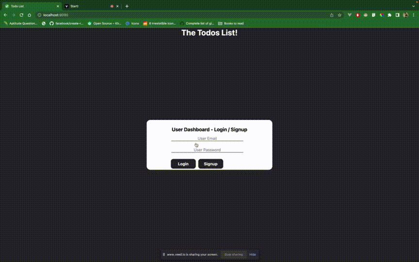

# TODO App

<b>TODO App using Vanilla JS, Node JS and Mysql - Introductory web development </b>

### Pre-requisites
Make sure to install followinng
* Node JS
* yarn
* npx
* mysql

### Local setup
* To run the express Node JS server follow the below steps after cloning and updating your `mysql` configs in `config.env`

* Run the [migration]('./migration.sql') in any Mysql client

``` shell
	yarn
    . ./config.env && yarn start
```

- The server will be started in the port 3000
- To run the client, follow these steps
``` shell
   cd client
   npx http-server . -p 9090
```
- Now the Todo app will be running in port 9090

### Purpose
- This is an introductory code session to give a hands on experience on full stack app development from design -> development phase
- Feel free to contribute to this or make use of this

### Working of the app

